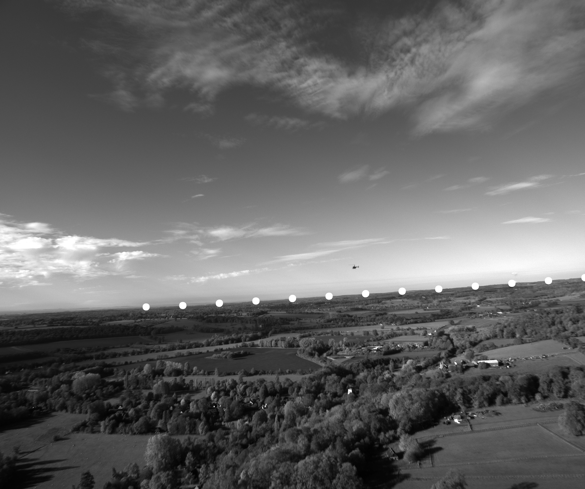

# horizon detection
--------
Horizon Detection has many applications. One useful way it is applied is with model ensembling for convolutional neural networks. Essentially, 2 separate CNNs will learn to track objects in the sky and track objects below rather than have 1 CNN trying to learn to track objects in the entire field of view.

## Otsu's Treshold method
The method that I am using for detection will be Otsu’s threshold method.
* This method tries multiple thresholding values and return the threshold that minimized a cost function.
* This cost function is measured by the variance of the pixels above the threshold plus the variance of the pixels below the threshold.
* This should do well with detecting the sky and ground because they have a disparate pixel distribution.

## Optimizations

However, running this method on an entire image may not work many times because the lighting can throw things off
* To improve the horizon detection, a sliding window is ran and Otsu’s threshold method is ran on vertical slices of the image
* It is also useful to ignore the very top and the very bottom of the image so we an option is available to just run this on a cropped version of the image
* Once we run Otsu’s threshold method we on vertical slices we will have multiple points on where the algorithm thinks the horizon is
* We drop any points that are clear outliers

## Results
Here are some results :)

